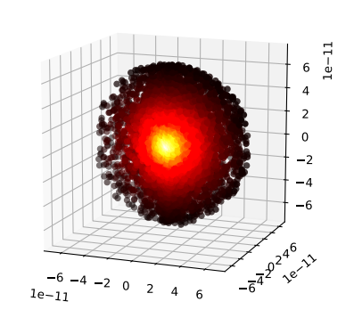
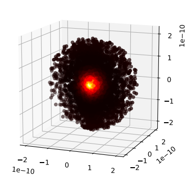
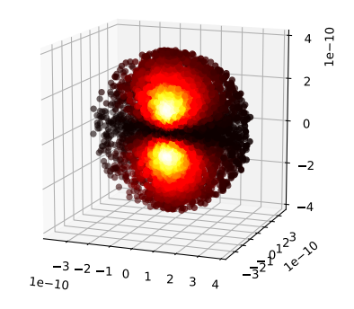
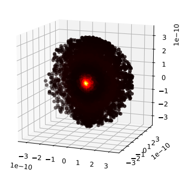
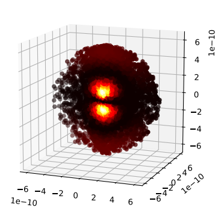
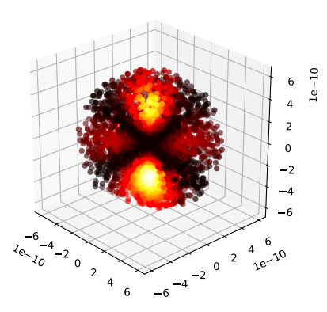

# QLab 2

This project consists of five elements:
- source (Source code folder)
- Numerical Simulation of the Probability Distribution in a Wave Function.pdf
- NSPDHAWF - Presentation.pdf
- Python Installation Manual With Libraries.pdf
- QLab App - Use Manual.pdf

The paper (Numerical Simulation of the Probability Distribution in a Wave Function.pdf) and implementation describes the use of Monte Carlo's Integration method to numerically simulate the behavior of the probability distribution in the real valued Wave Functions of the Hydrogen atom. The paper also mentions and develops the general integration of the probability distribution in a general wave function.

The document 'NSPDHAWF - Presentation.pdf' is a beamer like presentation which as all the .pdf files in this repository was written in LaTeX.

This project is licensed with MIT License, comply with the Digital Millennium Copyright Act: 17 U.S.C. §§ 101, 104, 104A, 108, 132, 114, 117, 701

**Remember** to include the MIT Licence and the original creator of this project (all them if derived subsequent times).

## Monte Carlo Integral of H1s

    

## Monte Carlo Integral of H2s

    

## Monte Carlo Integral of H2p

    

## Monte Carlo Integral of H3s

    

## Monte Carlo Integral of H3p

    

## Monte Carlo Integral of H3d

    

